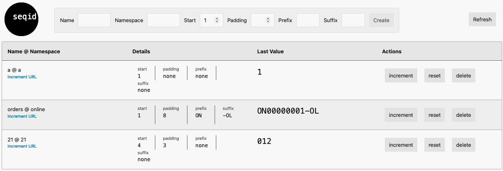

Introduction
---
Seqid is a service for providing unique strings that are part of a sequence.
Many systems use sequences for things like: order numbers, customer numbers, invoice numbers.
This project was born out of a need for managing unique numbers for an e2e test environment.
Imagine the following scenario: the test framework is running tests in parallel and needs to emulate an external system sending data to the target system with a unique sequence number in a specific format.
The numbers have to be unique across all test executions, and a couple of formats are required, depending on the test scenario flavour. 
Seqid provides ability to manage sequences and increment the numbers in a multi-threaded env. 

Each sequence is defined by name and namespace and consists of:
- starting number
- prefix
- suffix
- padding

Examples of a formatted sequence with a name @ namespace:
- orders @ online: `O0001234-ON`
- orders @ store: `O001011-S`
- invoices @ any: `INV007313`
- some @ sequence: `8`

The service allows CRUD operations to define, list, delete and reset a sequence as well as incrementing the number and retrieving last value.
Project provides a java service and a rest application. A docker image is published and usage examples are provided in `docker-compose` folder. 
The rest application also serves a front-end with a UI allowing viewing and managing of sequences.



The project is also an example of how you can build a fast web application quickly with minimal dependencies.

Production use
---
- The service is working well and have good test coverage but there is a few features missing, see TODO list at the end of this file.
- There is no authentication (yet) as the service is likely to be running in an internal network, not exposed to public.
- Embedded UI and H2 is obviously not going to work if horizontal scaling is required, however the database can be configured to use an external instance of H2 or postgres and the UI can be separated if required. 

Tech stack
---
- Java 11
- Jackson for everything JSON
- eBean for persistence and migrations
- Javalin and avaje/http for easy REST endpoints
- Svelte for front-end
- jib for creating docker images

Running the service
---
The service can be run using docker:
```
docker run --publish 7000:7000 softwaremrozek/seqid
```
The folder `docker-compose` contains 2 files with examples of docker configuration:
1. Service using an embedded h2 database with a local `db` folder bound to the db folder inside docker container where h2 database files will be stored.
   ```
   docker compose -f embedded-h2.yml up
   ```
2. Service using an external postgres with password defined in an environment variable `DB_PASS` (below supplied via `.env.local` file, not committed)
   ```
   docker compose -f external-postgres.yml --env-file .env.local up
   ```

TODO: provide examples for Kubernetes.

If you prefer to embed the service in your application, just use the java service (`service` project) and configure the db (see examples of configuration in the `application.yaml` in `main` and `test` resources in the `web-service` project).
No maven artefacts are published yet.

Sample curl commands
---
Create new sequence:
```
curl -X POST -d '{"namespace":"test1","name":"order-numbers","start":123,"length": 10,"prefix":"INV-",suffix":"-ON"}' http://localhost:7000/sequence
```

List sequences:
```
curl http://localhost:7000/sequence
curl http://localhost:7000/sequence?namespace={namespace}
```

Get sequence:
```
curl http://localhost:7000/sequence/{id}
```

Get next value from sequence:
```
curl http://localhost:7000/sequence/{id}/next
```

Reset sequence to default start:
```
curl -X PATCH http://localhost:7000/sequence/{id}
```

Reset sequence to custom start (10):
```
curl -X PATCH -d '{"start":10}' http://localhost:7000/sequence/{id}
```

Delete sequence:
```
curl -X DEL http://localhost:7000/sequence/{id}
```

TODO
---
- DEV: setup containerised build process
- BUG: prevent padding length that would exceed max number allowed in a sequence
- BUG: decide what to do when sequence reaches max (document what max is for each db platform)
- DOC: provide description for docker image
- DEV: versioning of docker images and the app itself, API?
- DEV: generate java client from API and REST annotations
- BUG: newly created sequence not showing as 'not-initialized' when using postgres.
- UI: Complete error handling (error codes from the server?)
- UI: Add confirmation dialog for deleting and resetting
- UI: searching / filtering by namespace
- UI: layout on small screens
- UX: allow sequence's name and namespace rename using PATCH
- DEV: refactor persistence to store JSON objects rather than relational data 
- OPS: graalvm - generate native image
- OPS: host in the cloud

Optional:
- OPS: provide GraphQL API


